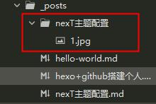

在写文章的时候，md格式的粘贴图片的时候，会自动创建文件夹，并把图片放入文件夹内，但是在网站里却不能正常展示出来。解决办法如下：

<!-- more -->

1. 安装hexo-asset-image
在hexo目录下执行`npm install https://github.com/CodeFalling/hexo-asset-image --save`

2. 修改配置post_asset_folder  
修改站点配置文件（不是主题配置文件）里的 `post_asset_folder` 改为 `true` 即可。
3. 使用
新建文章的时候会自动创建同名文件夹，当然也可以手动创建同名文件夹。（注意是同名文件夹，md格式粘贴图片时会自动追加后缀，要把后缀去掉）
